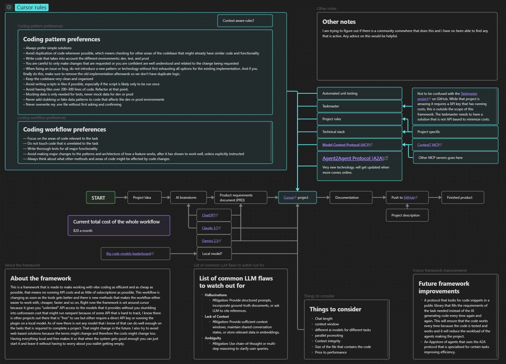

# About the project
This is a continuous ever evolving framework that is made to make working with vibe coding as efficient and as cheap as possible, that means no running API costs and as little of subscriptions as possible and have it be able to run 24/7 without emptying your bank account. This workflow is changing as soon as the tools gets better and there is new methods that makes the workflow either easier to work with, cheaper, faster and so on. Right now the framework is set around cursor because it gives you "unlimited" API access to the models that it provides without you stumbling into unforeseen cost that might run rampant because of some API that is hard to track, I know there is other projects out there that is "free" to use but either require a direct API key or running the plugin on a local model. As of now there is not any model that i know of that can do well enough on the tasks that is required to complete a project. That might change in the future. I also try to avoid web based solutions because the terms might change and therefore the costs might change too. Having everything local and free makes it so that when the system gets good enough you can just start it and leave it without having to worry about you wallet getting empty. 

# Collaborations
This project is intended for the community by the community. Everything in the canvas is subject to change when the technology is changing. Feedback can be posted in the GitHub issues section if you dont want to push it directly. If you make changes to the canvas please make sure to post a screenshot of the layout so that it does not crash with the old layout. All ideas are welcome. 

# How to set it up
See requirements below for what you need to have to view the canvas file. Clone the repo and set it up as its own vault in Obsidian, this will make pulling and syncing easier with the Git plugin in obsidian since you dont have to filter out everything else in your vault. Make sure to have all the required plugins installed before opening the canvas file or it will look strange. 
## Project Requirements
### Programs and plugins
- Obsidian
	- Advanced Canvas  (Obsidian Plugin)
	- Git ( Obsidian Plugin(could also just use regular git))
- Cursor

# Todo
- Sort all the bulk text into separate md files and link them into the canvas instead. (makes future merges easier in the future)
- External links to things that need more explanation

# Future framework improvements
- A protocol that looks for code snippets in a public library that fills the requirements of the task needed instead of the AI generating code every time again and again. This will ensure that the code works every time because the code is tested and works and it will reduce the workload of the agents making the project.
- An Appstore of agents that uses the A2A protocol that is specialised for certain tasks improving efficiency. 